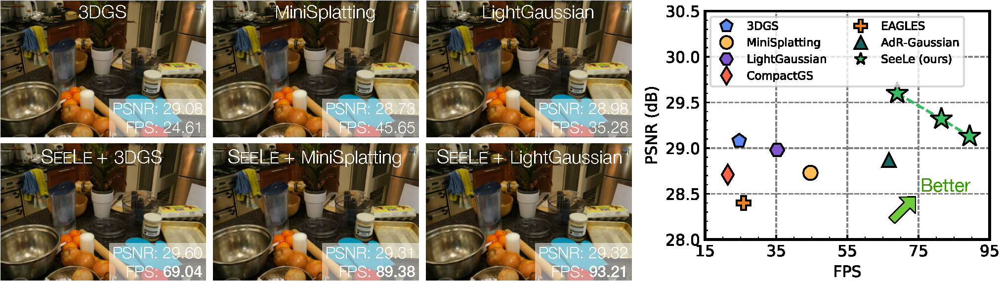

# SeeLe: A Unified Acceleration Framework for Real-Time Gaussian Splatting
| [🌍Webpage](https://seele-project.netlify.app/) | [📄Full Paper](https://arxiv.org/abs/2503.05168) | [🎥Video](https://seele-project.netlify.app/static/videos/arxiv_demo.mp4) |
<br>


## 🔍What is it?
This repository provides the official implementation of **SeeLe**, a general acceleration framework for the [3D Gaussian Splatting (3DGS)](https://github.com/graphdeco-inria/gaussian-splatting) pipeline, specifically designed for resource-constrained mobile devices. Our framework achieves a **2.6× speedup** and **32.5% model reduction** while maintaining superior rendering quality compared to existing methods. On an NVIDIA AGX Orin mobile SoC, SeeLe achieves over **90 FPS**⚡, meeting the real-time requirements for VR applications.

There is a short demo video of our algorithm running on an Nvidia AGX Orin SoC:

https://github.com/user-attachments/assets/5831a20a-c2e2-4c57-876f-2ef913900cd3
> Low resolution due to GitHub size limits. For higher resolution videos, please visit our [website](https://seele-project.netlify.app/).

## 🛠️ How to run?
### Installation
To clone the repository:
```shell
git clone https://github.com/SJTU-MVCLab/SeeLe.git --recursive && cd SeeLe
```
To install requirements:
```shell
conda create -n seele python=3.9
conda activate seele
# Example for CUDA 12.4:
pip3 install torch==2.6.0 torchvision==0.21.0 torchaudio==2.6.0 --index-url https://download.pytorch.org/whl/cu124
pip3 install -r requirements.txt
```
**Note:** [PyTorch](https://pytorch.org/) installation varies by system. Please ensure you install the appropriate version for your hardware.

### Dataset
We use datasets from **MipNeRF360** and **Tank & Temple**, which can be downloaded from the authors' official [website](https://jonbarron.info/mipnerf360/). The dataset should be organized in the following structure:
```
dataset
└── seele    
    └── [bicycle|bonsai|counter|train|truck|playroom|drjohnson|...]
        ├── images 
        └── sparse
```

## 🚀 Training and Evaluation 
This section provides detailed instructions on how to **train**, **cluster**, **fine-tune**, and **render** the model using our provided scripts. We also provide **standalone evaluation scripts** for assessing the trained model.  

### 🔄 One-Click Pipeline: Run Everything at Once  
For convenience, you can use the `run_all.sh` script to **automate the entire process** from training to rendering in a single command:  
```shell
bash scripts/run_all.sh
```
**Note:** By default, all scripts will run on an exmaple scene "**Counter**" from **MipNeRF360**. If you want to train on other datasets, please modify the `datasets` variable in the script accordingly.

### 🏗️ Step-by-Step Training and Rendering  
#### 1. Train the 3DGS Model (30,000 Iterations)  
To train the **3D Gaussian Splatting (3DGS) model**, use:  
```shell
bash scripts/run_train.sh seele
```

#### 2. Cluster the Trained Model  
Once training is complete, apply **k-means clustering** to the trained model with:  
```shell 
bash scripts/generate_cluster.sh seele
```

#### 3. Fine-Tune the Clustered Model  
After clustering, fine-tune the model for better optimization:  
```shell
bash scripts/run_finetune.sh seele
```

#### 4. Render the Final Output with SeeLe  
To generate the rendered images using the fine-tuned model, run:  
```shell
bash scripts/run_seele_render.sh seele
```

### 🎨 Evaluation  
After training and fine-tuning, you can **evaluate the model** using the following standalone scripts:  

#### 1. Render with `seele_render.py`  
Renders a **SeeLe** model with optional fine-tuning:  
```shell
python3 seele_render.py -m <path_to_model> [--load_finetune] [--debug]
```
- **With `--load_finetune`**: Loads the **fine-tuned** model for improved rendering quality. Otherwise, loads the model **before fine-tuning**(output from `generate_cluster.py`).  
- **With `--debug`**: Prints the execution time per rendering.
  
#### 2. Asynchronous Rendering with `async_seele_render.py`  
Uses **CUDA Stream API** for **efficient memory management**, asynchronously loading fine-tuned Gaussian point clouds:  
```shell
python3 async_seele_render.py -m <path_to_model> [--debug]
```

#### 3. Visualize in GUI with `render_video.py`  
Interactively preview rendered results in a GUI:  
```shell
python3 render_video.py -m <path_to_model> --use_gui [--load_seele]
```
- **With `--load_seele`**: Loads the **fine-tuned SeeLe** model. Otherwise, loads the **original** model.

## 🏋️‍♂️ Validate with a Pretrained Model  
To verify the correctness of **SeeLe**, we provide an example(dataset and checkpoint) for evaluation. You can download it [here](https://drive.google.com/file/d/1xfqSLFSLvx5IrpEZU62dw7xm1YZHiyYu/view?usp=sharing). This example includes the following key components:  

- **clusters** — The fine-tuned **SeeLe** model.  
- **point_cloud** — The original **3DGS** checkpoint.  

You can use this checkpoint to test the pipeline and ensure everything is working correctly. 

## 🙏 Acknowledgments  

Our work is largely based on the implementation of **[3DGS](https://github.com/graphdeco-inria/gaussian-splatting)**, with significant modifications and optimizations to improve performance for mobile devices. Our key improvements include:  

- **`submodules/seele-gaussian-rasterzation`** — Optimized **[diff_gaussians_splatting](https://github.com/graphdeco-inria/diff-gaussian-rasterization/tree/9c5c2028f6fbee2be239bc4c9421ff894fe4fbe0)** with **Opti** and **CR** techniques.  
- **`generate_cluster.py`** — Implements **k-means clustering** to partition the scene into multiple clusters.  
- **`finetune.py`** — Fine-tunes each cluster separately and saves the trained models.  
- **`seele_render.py`** — A modified version of `render.py`, designed to **load and render SeeLe models**.  
- **`async_seele_render.py`** — Utilizes **CUDA stream API** for **asynchronous memory optimization** across different clusters.  
- **`render_video.py`** — Uses **pyglet** to render images in a GUI. The `--load_finetune` option enables **SeeLe model rendering**.  

For more technical details, please refer to our [paper](https://arxiv.org/abs/2503.05168).

## 📬 Contact  
If you have any questions, feel free to reach out to:  

- **Xiaotong Huang** — [hxt0512@sjtu.edu.cn](mailto:hxt0512@sjtu.edu.cn)  
- **He Zhu** — [2394241800@qq.com](mailto:2394241800@qq.com)  

We appreciate your interest in **SeeLe**!  

## 📖 Citation
If you find this work helpful, please kindly consider citing our paper:
```
@article{huang2025seele,
  title={SeeLe: A Unified Acceleration Framework for Real-Time Gaussian Splatting},
  author={Xiaotong Huang and He Zhu and Zihan Liu and Weikai Lin and Xiaohong Liu and Zhezhi He and Jingwen Leng and Minyi Guo and Yu Feng},
  journal={arXiv preprint arXiv:2503.05168},
  year={2025}
}
```
